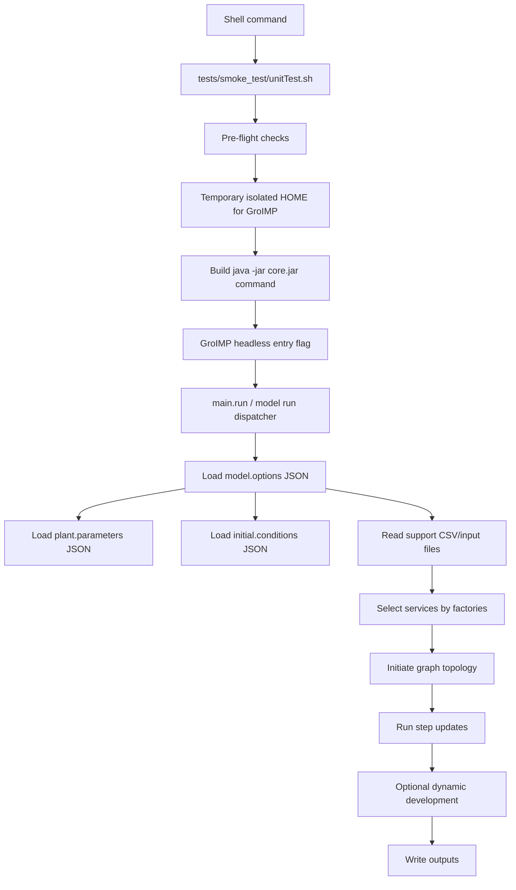
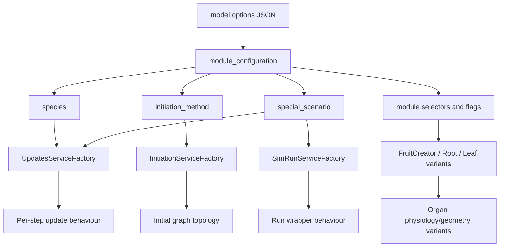

# FruitCropXL execution guide

This document summarises how the current `tests/smoke_test/unitTest.sh` wrapper launches FruitCropXL through GroIMP, how the command-line options map to model-side runtime behaviour, and how model-options JSON files control the actual simulation configuration.

The key point is that `unitTest.sh` is now more than a unit-test script. It is a **portable direct-Java GroIMP headless launcher**. Depending on the first argument, it can run a unit smoke test, a validation test, or a normal short `Xrun` simulation.

---

## 1. Mental model



Equivalent compact form:

```text
unitTest.sh
  -> java -jar GroIMP/core.jar --headless -X...
  -> FruitCropXL run entry
  -> model.options.*.json
  -> service factories
  -> initiation
  -> step updates
  -> optional development
  -> output tables/logs
```

---

## 2. Common command patterns

### 2.1 Normal short simulation smoke test

Use this when you want to check that a scenario can initiate and run for a few steps.

```bash
GROIMP_KEEP_RUNTIME_HOME=1 timeout 420 bash tests/smoke_test/unitTest.sh \
  Xrun \
  default \
  2 \
  model.options.fieldRandomCanopy.kiwiShape.grapevinePhysiology.json
```

Meaning:

| Argument | Value | Meaning |
|---|---:|---|
| `test_type` | `Xrun` | Use the normal model run entry point. |
| `validation_scenario` | `default` | Passed as `-XvalidationTestScenario=default`; usually not important for pure `Xrun`. |
| `num_steps` | `2` | Passed as `-XrunEndSteps=2`; limits the run to a few model steps. |
| `model_options_file` | `model.options.fieldRandomCanopy.kiwiShape.grapevinePhysiology.json` | The active scenario/configuration file under `Model_scenarios/`. |

Approximate command built by the script:

```bash
java <JAVA_OPTS> -jar /usr/share/GroIMP/core.jar \
  --headless \
  -Xrun \
  -XmodelPath=<repo>/ \
  -XvalidationTestScenario=default \
  -XmodelOptions=model.options.fieldRandomCanopy.kiwiShape.grapevinePhysiology.json \
  -XrunEndSteps=2 \
  <repo>/Scripts/project.gs
```

### 2.2 Default portable smoke test

```bash
bash tests/smoke_test/unitTest.sh
```

Default values:

```text
test_type            = XrunTests
validation_scenario  = default
num_steps            = empty / unset
model_options_file   = model.options.default.json
```

This is the minimal hosted/cloud-compatible smoke-test command.

### 2.3 Normal run for more steps

```bash
timeout 1800 bash tests/smoke_test/unitTest.sh \
  Xrun \
  default \
  48 \
  model.options.default.json
```

Use this for a short multi-day or multi-step local run. The biological meaning of `48` depends on the model step convention of the active scenario, but FruitCropXL commonly operates at hourly resolution for physiology.

### 2.4 Keep GroIMP runtime logs

```bash
GROIMP_KEEP_RUNTIME_HOME=1 bash tests/smoke_test/unitTest.sh \
  Xrun default 2 model.options.default.json
```

The script prints something like:

```text
Keeping GroIMP runtime home: tmp/groimp_home_<user>_<pid>
```

Then inspect:

```text
tmp/groimp_home_<user>_<pid>/.grogra.de-platform/log/platform0-0.xml
```

### 2.5 Archive-based run using `Scripts/Scripts.gsz`

```bash
ARCHIVE_TEST=1 bash tests/smoke_test/unitTest.sh \
  Xrun default 2 model.options.default.json
```

When `ARCHIVE_TEST=1`, the default project file becomes:

```text
Scripts/Scripts.gsz
```

instead of:

```text
Scripts/project.gs
```

Use this when you want to test the archive-style entry point. Be careful: source edits in `.rgg` files may not be reflected in `Scripts/Scripts.gsz` until the archive is refreshed.

Build and validate the archive only after source validation succeeds:

```bash
bash bash_scripts/zip_groimp.sh
bash tests/gsz_test/validate_gsz_structure.sh
bash tests/gsz_test/run_archive_test.sh default
```

`zip_groimp.sh` performs a complete deterministic rebuild in a clean
temporary workspace. It does not update `Scripts.gsz` in place. The temporary
candidate must pass ZIP integrity, root-layout, required-entry, manifest, and
content checks before an atomic replacement. Files such as `project.gs`,
`graph.xml`, `META-INF/MANIFEST.MF`, `workbench.options`, source modules, Java
helpers, and images are at the archive root rather than beneath a `Scripts/`
directory.

Ordinary model sources and resources are packaged from the working tree.
GroIMP-managed `project.gs`, `graph*.xml`, `META-INF/MANIFEST.MF`, and
`workbench.options` are packaged from committed `HEAD` by default. Neither
unstaged nor staged-but-uncommitted GroIMP saves can therefore make the local
archive differ from a clean CI checkout, and packaging does not depend on Git
index state.

For an intentional GroIMP project-file update, select the working tree
explicitly:

```bash
bash bash_scripts/zip_groimp.sh --metadata-source=worktree
bash tests/gsz_test/validate_gsz_structure.sh --metadata-source=worktree
bash tests/gsz_test/finalise_repository.sh --metadata-source=worktree
```

The changed project files and archive must then be committed together. CI does
not require fixed GroIMP node IDs or a hard-coded SHA-256 value; it requires
exact canonical contents, two byte-identical fresh builds, and a committed
archive that matches the clean rebuild.

For the complete ordered pre-commit workflow, including source validation,
reproducibility, functional GroIMP archive execution, documentation checks,
and final regression, run:

```bash
bash tests/gsz_test/finalise_repository.sh
```

This command does not create a Git commit.

### 2.6 Override GroIMP installation

```bash
GROIMP_DIR=/opt/GroIMP bash tests/smoke_test/unitTest.sh \
  Xrun default 2 model.options.default.json
```

or:

```bash
GROIMP_CORE_JAR=/opt/GroIMP/core.jar bash tests/smoke_test/unitTest.sh \
  Xrun default 2 model.options.default.json
```

### 2.7 Use a custom project file

```bash
PROJECT_FILE=/path/to/project.gs bash tests/smoke_test/unitTest.sh \
  Xrun default 2 model.options.default.json
```

---

## 3. Positional arguments of `unitTest.sh`

```bash
./unitTest.sh [test_type] [validation_scenario] [num_steps] [model_options_file]
```

| Position | Shell variable | GroIMP/model argument | Meaning |
|---:|---|---|---|
| `$1` | `TEST_TYPE` | `-${TEST_TYPE}` | Selects the GroIMP/FruitCropXL headless run flag, e.g. `-Xrun`, `-XrunTests`, `-XrunValidationTests`. |
| `$2` | `VALIDATION_SCENARIO` | `-XvalidationTestScenario=<value>` | Scenario key used mainly by validation-mode orchestration. Less important for pure `Xrun`. |
| `$3` | `NUM_STEPS` | `-XrunEndSteps=<value>` | Optional step cap. Decimal values are truncated by the shell script. |
| `$4` | `MODEL_OPTIONS` | `-XmodelOptions=<basename>` | Active `model.options.*.json` file name under `Model_scenarios/`. |

Important detail:

```bash
MODEL_OPTIONS_BASENAME="$(basename "${MODEL_OPTIONS}")"
```

So the fourth argument should be a **file name**, not a full path. If you pass a path, the script strips it to the basename and checks for it under:

```text
Model_scenarios/<model_options_file>
```

Correct:

```bash
model.options.default.json
```

Tolerated but reduced to basename:

```bash
Model_scenarios/model.options.default.json
```

Incorrect if the basename does not exist under `Model_scenarios/`:

```bash
/tmp/model.options.default.json
```

---

## 4. Environment variables recognised by the script

| Variable | Default | Effect |
|---|---|---|
| `.env` | loaded automatically if present | Allows local defaults without editing the script. |
| `GROIMP_DIR` | `/usr/share/GroIMP` | GroIMP installation directory. |
| `GROIMP_CORE_JAR` | `${GROIMP_DIR}/core.jar` | Direct path to `core.jar`; overrides `GROIMP_DIR/core.jar`. |
| `JAVA_BIN` | `java` | Java executable. |
| `PROJECT_FILE` | `Scripts/project.gs` | Project file passed to GroIMP. |
| `ARCHIVE_TEST=1` | unset / `0` | Uses `Scripts/Scripts.gsz` as default project file. |
| `MODEL_OPTIONS` | `model.options.default.json` | Environment-level model-options override. The fourth positional argument can also set this. |
| `GROIMP_RUNTIME_HOME` | temporary folder under `tmp/` | Isolated HOME for GroIMP/Java preferences and logs. |
| `GROIMP_KEEP_RUNTIME_HOME=1` | unset / `0` | Keeps the temporary runtime HOME after completion. Useful for debugging GroIMP logs. |
| `JAVA_OPTS` | internal defaults | Replaces the default Java option array completely. Use carefully. |

Default Java options in the script:

```bash
-Djava.awt.headless=true
-Duser.home=${RUNTIME_HOME}
-Djava.util.prefs.userRoot=${RUNTIME_HOME}/.java/.userPrefs
-Xms2g
-Xss1m
-XX:+UseSerialGC
-XX:+UnlockDiagnosticVMOptions
-XX:-TieredCompilation
-XX:+AlwaysPreTouch
-noverify
```

If `JAVA_OPTS` is set, the script uses your value instead of this default array.

---

## 5. Model-side run modes

The first argument controls the headless flag passed to GroIMP:

```text
-Xrun
-XrunTests
-XrunValidationTests
```

The exact behaviour depends on the model-side command-line parser and run dispatcher.

### 5.1 `Xrun`: normal simulation mode

Typical command:

```bash
bash tests/smoke_test/unitTest.sh \
  Xrun default 2 model.options.default.json
```

Conceptual behaviour:

```text
-Xrun
  -> model run entry
  -> load active model-options file
  -> if -XrunEndSteps is provided, call bounded runEnd(maxSteps)
  -> otherwise call the selected SimRunService
```

Use this for:

- normal short smoke tests
- model-options debugging
- architecture/initiation tests
- output checks
- testing a new `model.options.*.json`

### 5.2 `XrunTests`: lightweight unit/smoke test mode

Typical command:

```bash
bash tests/smoke_test/unitTest.sh \
  XrunTests default 24 model.options.default.json
```

Conceptual behaviour:

```text
-XrunTests
  -> model test mode
  -> TestRunner / basic unit-test path
```

Use this for:

- hosted/cloud smoke tests
- minimal regression checks
- quick check that the project compiles and the default model can start

### 5.3 `XrunValidationTests`: validation orchestration mode

Typical command:

```bash
bash tests/smoke_test/unitTest.sh \
  XrunValidationTests default 24 model.options.default.json
```

Conceptual behaviour:

```text
-XrunValidationTests
  -> validation-mode dispatch
  -> read validation scenario key from -XvalidationTestScenario
  -> resolve startup model-options if the validation runner overrides it
  -> reset/initiate/run validation hooks
```

Use this for:

- scenario-specific validation tests
- test hooks under `Scripts/utils/validationTests.rgg`
- validation workflows where `validation_scenario` is meaningful

### 5.4 Dataset or server style modes

The current runtime documentation also refers to dataset and server helpers:

```text
Scripts/utils/dataset.rgg
Scripts/utils/server.rgg
```

These are model-side utilities rather than standard `unitTest.sh` positional examples. If the model exposes command-line flags such as dataset/server flags through the same raw property system, they can be routed by extending the first argument or by adding explicit `-X...` flags to the script.

Use direct code inspection of `Scripts/main/main.rgg`, `Scripts/config/simRunBase.rgg`, `Scripts/utils/dataset.rgg`, and `Scripts/utils/server.rgg` before standardising these as documented CLI commands.

---

## 6. What the model-options file controls

The fourth argument is the main biological and structural scenario selector:

```bash
model.options.<scenario>.json
```

It is resolved under:

```text
Model_scenarios/
```

The current configuration workflow is centred on three JSON families:

```text
Model_scenarios/model.options.*.json
Model_scenarios/plant.parameters.*.json
Model_scenarios/initial.conditions.*.json
```

Conceptual ownership:

| File family | Main responsibility |
|---|---|
| `model.options.*.json` | Runtime scenario: species, initiation path, module toggles, input file names, planting geometry, simulation window, output controls, management/planner settings. |
| `plant.parameters.*.json` | Physiological and structural parameters: organ, gas exchange, water, carbon, nitrogen, fruit, root, species-specific parameters. |
| `initial.conditions.*.json` | Startup state: age, initial biomass, fruit state, wood/root initial state, selected leaf/N state. |

### 6.1 Important `model.options` categories

| Category | Typical role |
|---|---|
| `module_configuration` | Species, initiation method, special scenario, complex/simple module selection, model parameter file names. |
| `model_functionality` | Switches for light, gas exchange, water, carbon allocation, static/dynamic architecture, phenology, CTRAM, structural variation. |
| `location` | Latitude, longitude, site context, often used for light/solar calculations. |
| `planting_system` | Row distance, plant distance, row orientation, planting geometry. |
| `mean_climate` | Simplified climate defaults when external climate is not used. |
| `simulation_time` | Start/end date or step/time controls. |
| `morphology` | Architecture and geometry controls. |
| `environment_climate` | Climate file and environment input behaviour. |
| `scenario_required_files` | Required support files: architecture CSVs, root files, leaf profiles, phenology, shading, fruit support files. |
| `output_controls` | Output tables, organ-level output, chart/CSV/JSON output behaviour. |
| planner-related blocks | Bud, leaf, fruit, twinning, and management/planner behaviour. |

### 6.2 Important runtime switches

| Switch | Typical effect |
|---|---|
| `species` | Routes to apple, grapevine, or other species-specific service logic. |
| `initiation_method` | Selects how the initial graph topology is built. |
| `special_scenario` | Selects special run/update/initiation wrappers where implemented. |
| `useStaticArc` | `true`: mostly fixed topology after initiation. `false`: dynamic development can add/replace/terminate organs. |
| `useStructuralVariation` | Uses structural-variation generation/development paths where implemented. |
| `calcLightInterception` | Enables/disables radiation interception calculations. |
| `calcPotential_PT` | Enables potential photosynthesis/transpiration calculation. |
| `calcActual_PT` | Enables water-stress-adjusted actual gas exchange. |
| `calcCarbonAllocation` | Enables carbon allocation/transport calculations. |
| `useCTRAM` | Switches toward explicit carbon transport rather than common assimilate pool behaviour. |
| `inputEnvironmentCondition` | `true`: read climate file. `false`: generate/use simplified internal environment. |
| `usePhenology` | Enables phenology-driven stage transitions and phenology file usage. |
| `useComplexRoot` | Switches root model complexity where supported. |
| `useComplexLeaf` | Switches leaf model complexity where supported. |
| `fruitModule` | Selects `simpleFruit` (`SimpleFruit`), `complexBerry` (`ComplexBerry`), or `virtualFruit` (`VirtualFruit`) physiology. |
| `output_controls.*` | Controls CSV/table/chart/organ-level outputs. |

---

## 7. Runtime service-selection map

FruitCropXL uses factory-selected services rather than one monolithic runtime class.



Common interpretation:

| Model-options field | Factory or module family affected | Practical result |
|---|---|---|
| `species` | `UpdatesServiceFactory`, species-specific organs and development | Apple vs grapevine update and organ logic. |
| `initiation_method` | `InitiationServiceFactory` | How the graph is initiated: coded structure, CSV architecture, single organ, structural variation, field clone, etc. |
| `special_scenario` | `SimRunServiceFactory`, sometimes updates/initiation | Special runtime wrappers, dataset/validation/research runs, fruit population, single-root, virtual-fruit modes if implemented. |
| `useStructuralVariation` | `DevelopServiceFactory`, initiation/development paths | Enables structural-variation-sensitive topology generation. |
| `fruitModule` | `FruitCreator`, fruit modules | Instantiates exactly one of `SimpleFruit`, `ComplexBerry`, or `VirtualFruit` from the `simpleFruit`, `complexBerry`, or `virtualFruit` selector. |
| `useCTRAM` | Carbon transport module | Explicit transport/CTRAM rather than plant-level common pool. |

---

## 8. Typical initiation modes and special scenarios

The exact list depends on the current `Scripts/config/initiationBase.rgg` and factory code. Common modes in the current documentation and project conventions include:

| Mode / scenario | Expected purpose |
|---|---|
| `ArchReader` | Read existing shoot/canopy architecture from CSV or reconstructed input. |
| `ArchReaderGPU` | Architecture-reader variant compatible with GPU/light workflows where implemented. |
| `structuralVariation` | Generate or apply statistical structural variation. |
| `singleLeaf` | Run a minimal single-leaf configuration. Useful for gas-exchange debugging. |
| `singleRoot` | Run a minimal or root-focused configuration. Useful for below-ground/root-water debugging. |
| `standardGridClone` | Replicate a standard plant/grid clone structure for field or row context. |
| `berry_population` | Fruit population scenario where many fruits are simulated as a population. |
| `virtualFruit` | Scenario using virtual-fruit coupling where supported. |
| `fieldRandomCanopy` | Field or random-canopy reconstruction/generation workflow. |

Do not assume a mode is active from the file name alone. Confirm the actual `initiation_method`, `special_scenario`, and `species` inside the active `model.options.*.json`.

---

## 9. Output locations and naming

For pure `Xrun` runs, the effective output folder usually follows the model-options scenario name rather than the second positional argument.

Example:

```text
model.options.fieldRandomCanopy.kiwiShape.grapevinePhysiology.json
```

can produce:

```text
Model_output/fieldRandomCanopy_kiwiShape_grapevinePhysiology/
```

The second script argument:

```text
-XvalidationTestScenario=default
```

is mainly meaningful for validation mode. In pure `Xrun`, the model-options file is normally the real scenario selector.

Typical output families:

| Output family | Interpretation |
|---|---|
| Field-level outputs | Planting geometry, LAI, fPAR, absorbed radiation, vertical light profiles. |
| Plant-level outputs | Carbon assimilation, water flux, water-use efficiency, xylem/leaf water potentials, biomass, NSC, allocation. |
| Mean-fruit outputs | Fruit number, mean fresh/dry mass, sugar concentration, size, fruit water balance, sugar uptake. |
| Root-system outputs | Root architecture, root/soil water potential, layer uptake, ABA-related context. |
| Organ-level outputs | Leaf, fruit, root, and other organ-specific variables where enabled. |

---

## 10. Step-count interpretation

`num_steps` becomes:

```text
-XrunEndSteps=<num_steps>
```

In normal run mode, this usually limits the model through a bounded run path such as:

```text
runEnd(maxSteps)
```

For smoke tests, remember that step `0` often includes initiation/startup. So:

```bash
bash tests/smoke_test/unitTest.sh Xrun default 2 model.options.xxx.json
```

is best interpreted as:

```text
initiate/startup + a few update steps
```

not necessarily as a full two-day simulation.

---

## 11. Runtime-home and log handling

The script isolates GroIMP/Java preferences by overriding `HOME`:

```text
HOME=<repo>/tmp/groimp_home_<user>_<pid>
```

It also creates:

```text
<runtime_home>/.java/.userPrefs
<runtime_home>/.grogra.de-platform/log
```

This avoids Java preference lock contention and makes headless runs more reproducible.

By default, temporary runtime HOME is deleted after the run. Preserve it with:

```bash
GROIMP_KEEP_RUNTIME_HOME=1
```

Useful files:

```text
<runtime_home>/.grogra.de-platform/log/platform0-0.xml
```

---

## 12. Pre-flight checks performed by the script

The script fails early if:

| Check | Failure reason |
|---|---|
| `JAVA_BIN` exists | Java executable not found. |
| `GROIMP_CORE_JAR` exists | GroIMP installation or `core.jar` path wrong. |
| `PROJECT_FILE` exists | Project file missing or wrong entry point. |
| `Model_scenarios/<model_options_file>` exists | Model-options file missing or passed incorrectly. |
| `Model_output/<validation_scenario>/run-config` is writable | If run snapshot directory exists but is not writable, it is renamed and recreated. |

The run-config repair logic is tied to:

```text
Model_output/<VALIDATION_SCENARIO>/run-config
```

This is useful for old root-owned or non-writable run snapshots.

---

## 13. Recommended validation levels

| Level | Command | Use case |
|---|---|---|
| Minimal hosted smoke test | `bash tests/smoke_test/unitTest.sh` | Confirms the model starts under direct Java GroIMP. |
| Scenario smoke test | `bash tests/smoke_test/unitTest.sh Xrun default 2 model.options.xxx.json` | Confirms a specific model-options file initiates and runs briefly. |
| Local acceptance | `bash tests/validation/run_multiple_scenarios.sh default` | Broader local acceptance run using scenario wrapper. |
| CI-equivalent local validation | `bash tests/validation/run_like_github_actions.sh <scenario>` | Use when matching GitHub Actions behaviour is required. |
| Archive-based check | `ARCHIVE_TEST=1 bash tests/smoke_test/unitTest.sh ...` | Checks `Scripts/Scripts.gsz` entrypoint rather than source `project.gs`. |
| Archive structural check | `bash tests/gsz_test/validate_gsz_structure.sh` | Checks deterministic ZIP metadata, root layout, and exact source/archive contents. |
| Ordered final validation | `bash tests/gsz_test/finalise_repository.sh` | Runs source validation before packaging and repeats archive/documentation checks before commit. |
| Compile-error scan | `bash tests/diagnosis/grep_compile_errors.sh` | Use after failed GroIMP compile/run to detect semantic compile errors in logs. |

---

## 14. Common mistakes

### Mistake 1: Thinking the second argument selects the scenario

This command:

```bash
bash tests/smoke_test/unitTest.sh Xrun default 2 model.options.apple.json
```

uses:

```text
-XvalidationTestScenario=default
-XmodelOptions=model.options.apple.json
```

For pure `Xrun`, the model-options file is normally the active simulation scenario. The word `default` is mostly a validation-scenario placeholder.

### Mistake 2: Passing a model-options path instead of a file name

The model expects a file name. The script strips paths with `basename` and checks under `Model_scenarios/`.

Prefer:

```bash
model.options.default.json
```

not:

```bash
/path/to/model.options.default.json
```

### Mistake 3: Editing `.rgg` source but running an old archive

If `ARCHIVE_TEST=1` or `PROJECT_FILE=Scripts/Scripts.gsz`, the run may use the archive. Source edits may not appear until the archive is refreshed.

After source tests pass, refresh it only with the full atomic packager:

```bash
bash bash_scripts/zip_groimp.sh
```

The retired incremental updater could leave deleted entries stale and omit
new non-RGG files.

### Mistake 4: Overriding `JAVA_OPTS` too aggressively

If `JAVA_OPTS` is set, it replaces the script's full default Java option array. Make sure to preserve required memory, headless, and preference-isolation options if needed.

### Mistake 5: Confusing static and dynamic architecture behaviour

If `useStaticArc=true`, the topology is mostly fixed after initiation. If you expect new buds, apices, phytomers, leaves, or fruit to appear, check `useStaticArc`, `useStructuralVariation`, planner switches, and the active develop service.

### Mistake 6: Diagnosing physiology before checking initiation

A wrong `initiation_method` can create missing leaves, duplicate organs, incorrect topology, or unexpected LAI. Always inspect initiation before diagnosing carbon/water/gas-exchange behaviour.

### Mistake 7: Forgetting `output_controls`

Many outputs are controlled under `output_controls`. A missing output table does not always mean the process did not run.

---

## 15. Recommended comments to add to `unitTest.sh`

The script name is historical. It now acts as a direct Java headless launcher. Consider adding this comment near the header:

```bash
# NOTE:
# This script is named unitTest.sh for compatibility, but it can also run
# normal bounded FruitCropXL simulations by using TEST_TYPE=Xrun and a
# model-options file name, e.g.:
#
#   bash tests/smoke_test/unitTest.sh Xrun default 2 model.options.default.json
#
# In pure Xrun mode, the fourth argument is the active scenario/configuration.
# The second argument is mainly used by validation-mode orchestration.
```

Optional future refactor:

```text
tests/smoke_test/unitTest.sh                 # compatibility wrapper
tests/validation/groimp_headless_run.sh      # clearer direct-Java launcher name
```

---

## 16. Quick reference

### Command template

```bash
GROIMP_KEEP_RUNTIME_HOME=1 timeout 420 bash tests/smoke_test/unitTest.sh \
  <TEST_TYPE> \
  <VALIDATION_SCENARIO> \
  <NUM_STEPS> \
  <MODEL_OPTIONS_FILE_NAME>
```

### Most useful command

```bash
GROIMP_KEEP_RUNTIME_HOME=1 timeout 420 bash tests/smoke_test/unitTest.sh \
  Xrun \
  default \
  2 \
  model.options.fieldRandomCanopy.kiwiShape.grapevinePhysiology.json
```

### Most useful interpretation

```text
TEST_TYPE=Xrun
  -> normal run mode

VALIDATION_SCENARIO=default
  -> validation placeholder unless validation mode is active

NUM_STEPS=2
  -> bounded smoke test

MODEL_OPTIONS_FILE_NAME=model.options.fieldRandomCanopy.kiwiShape.grapevinePhysiology.json
  -> actual simulation configuration under Model_scenarios/
```

### First things to check when a run behaves unexpectedly

1. Which project entry is used: `Scripts/project.gs` or `Scripts/Scripts.gsz`?
2. Which `model.options.*.json` file is active?
3. What are `species`, `initiation_method`, `special_scenario`, `useStaticArc`, and `useStructuralVariation`?
4. Are required support files present under `Model_input/` or the expected configured path?
5. Are outputs enabled under `output_controls`?
6. If the run failed, inspect the preserved GroIMP runtime log under `.grogra.de-platform/log/`.

---

## 17. Source anchors for future maintenance

When this guide becomes stale, inspect these files first:

```text
tests/smoke_test/unitTest.sh
Scripts/main/main.rgg
Scripts/config/modelOptions.rgg
Scripts/config/plantParameters.rgg
Scripts/config/initialConditions.rgg
Scripts/config/initiationBase.rgg
Scripts/config/simRunBase.rgg
Scripts/main/outputTables.rgg
Scripts/utils/validationTests.rgg
Scripts/utils/dataset.rgg
Scripts/utils/server.rgg
```

Suggested update rule:

```text
If command-line flags change, update sections 3, 4, and 5.
If JSON categories or ownership change, update section 6.
If service factories change, update section 7.
If output names or folders change, update section 9.
```
